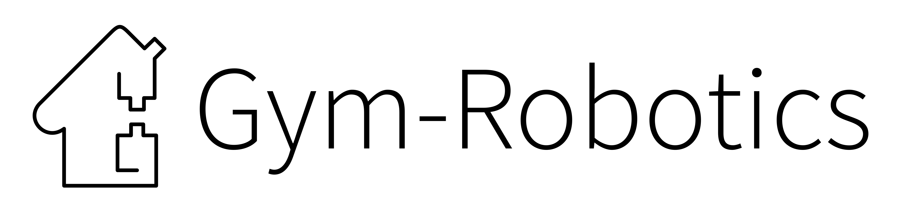

[](https://pre-commit.com/) 
[](https://github.com/psf/black)
<p align="center">
    
</p>

# Gym-Robotics
Details and documentation on these robotics environments are available in OpenAI's [blog post](https://blog.openai.com/ingredients-for-robotics-research/) and the accompanying [technical report](https://arxiv.org/abs/1802.09464).

Requirements:
- Python 3.7 to 3.10
- Gym v0.26
- NumPy 1.18+
- Mujoco 2.2.2

If you use these environments, please cite the following paper:

```bibtex
@misc{1802.09464,
  Author = {Matthias Plappert and Marcin Andrychowicz and Alex Ray and Bob McGrew and Bowen Baker and Glenn Powell and Jonas Schneider and Josh Tobin and Maciek Chociej and Peter Welinder and Vikash Kumar and Wojciech Zaremba},
  Title = {Multi-Goal Reinforcement Learning: Challenging Robotics Environments and Request for Research},
  Year = {2018},
  Eprint = {arXiv:1802.09464},
}
```

## New MuJoCo Python Bindings

The latest version and future versions of the MuJoCo environments will no longer depend on `mujoco-py`. Instead the new [mujoco](https://mujoco.readthedocs.io/en/latest/python.html) python bindings will be the required dependency for future gym MuJoCo environment versions. Old gym MuJoCo environment versions that depend on `mujoco-py` will still be kept but unmaintained.
Dependencies for old MuJoCo environments can still be installed by `pip install gym_robotics[mujoco_py]`.

## Fetch environments


[FetchReach-v3](https://gym.openai.com/envs/FetchReach-v0/): Fetch has to move its end-effector to the desired goal position.


[FetchSlide-v2](https://gym.openai.com/envs/FetchSlide-v0/): Fetch has to hit a puck across a long table such that it slides and comes to rest on the desired goal.


[FetchPush-v2](https://gym.openai.com/envs/FetchPush-v0/): Fetch has to move a box by pushing it until it reaches a desired goal position.


[FetchPickAndPlace-v2](https://gym.openai.com/envs/FetchPickAndPlace-v0/): Fetch has to pick up a box from a table using its gripper and move it to a desired goal above the table.

## Shadow Dexterous Hand environments


[HandReach-v1](https://gym.openai.com/envs/HandReach-v0/): ShadowHand has to reach with its thumb and a selected finger until they meet at a desired goal position above the palm.


[HandManipulateBlock-v1](https://gym.openai.com/envs/HandManipulateBlock-v0/): ShadowHand has to manipulate a block until it achieves a desired goal position and rotation.


[HandManipulateEgg-v1](https://gym.openai.com/envs/HandManipulateEgg-v0/): ShadowHand has to manipulate an egg until it achieves a desired goal position and rotation.


[HandManipulatePen-v1](https://gym.openai.com/envs/HandManipulatePen-v0/): ShadowHand has to manipulate a pen until it achieves a desired goal position and rotation.

# Hand environments with Touch Sensors

Touch sensor observations are also available in all Hand environments, with exception of `HandReach`. These environments add to the palm of the hand and the phalanges of the fingers two types of touch sensors depending on the environment. These touch sensors are:
- **Boolean Touch Sensor**: the observations of each touch sensor can return a value of `0` if no contact is detected with and object, and `1` otherwise.
- **Continuous Touch Sensor**: the value returned by each touch sensor is a continuous value that represents the external force made by an object over the sensor.

These environments are instanceated by adding the following strings to the Hand environment id's: `_BooleanTouchSensor` or `_ContinuousTouchSensor`. For example, to add boolean touch sensors to `HandManipulateBlock-v1`, make the environment in the following way:
```
env = gym.make('HandManipulateBlock_BooleanTouchSensor-v1')
```

If using these environments please also cite the following paper:

```bibtex
@article{melnik2021using,
  title={Using tactile sensing to improve the sample efficiency and performance of deep deterministic policy gradients for simulated in-hand manipulation tasks},
  author={Melnik, Andrew and Lach, Luca and Plappert, Matthias and Korthals, Timo and Haschke, Robert and Ritter, Helge},
  journal={Frontiers in Robotics and AI},
  pages={57},
  year={2021},
  publisher={Frontiers}
}
```
